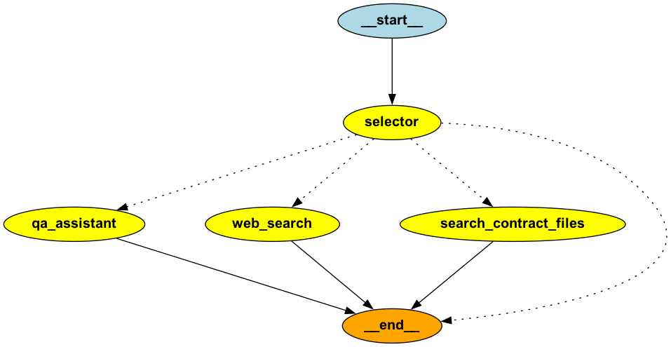

# 法務AIエージェント（試験実装中）

> [!WARNING]  
> 試験実装中  
> 弁護士法第72条に抵触しない範囲でご利用ください。

## 概要

法務的な内容を相談可能なアシスタントとしてのワークフローエージェントシステムです。  

## 利用方法

```shell
❯ python main.py --question "直近の労働基準法の改正に伴う労働条件の明示ルール変更についてwebで検索して教えて"
```

## ワークフロー図



| node名 | 説明 |
| --- | --- |
| qa_assistant | 法的な質問に対して単純に回答 |
| web_search | 質問に対してWeb検索した内容を踏まえて回答 |
| search_contract_files | ローカルに存在する契約書を検索し、1つのファイルのみを参照して質問に回答 | 

## 利用例

### 法的な質問に対して単純に回答

```shell
❯ python main.py --question "準委任の契約書のレビューをするに際して把握しておくべき条文は？"

準委任契約に関する日本法の条文は、主に民法に規定されています。以下の条文を把握しておくと良いでしょう。

1. **民法第643条（委任の定義）**
   - 委任契約の基本的な定義が記載されています。

2. **民法第644条（委任の効力）**
   - 委任契約の効力についての基本的な規定です。

3. **民法第645条（受任者の注意義務）**
   - 受任者が業務を遂行する際の注意義務について規定しています。

4. **民法第646条（受任者の報告義務）**
   - 受任者が委任者に対して業務の遂行状況を報告する義務についての規定です。

5. **民法第647条（受任者の報酬）**
   - 受任者が報酬を受け取る権利についての規定です。

6. **民法第648条（委任の終了）**
   - 委任契約が終了する場合についての規定です。

これらの条文を理解し、契約書の内容がこれらの規定に適合しているか、または特約がある場合にはその特約がどのようにこれらの規定を修正しているかを確認することが重要です。また、具体的な契約内容に応じて、他の関連する法律や条文も考慮する必要があるかもしれません。
```


### 質問に対してWeb検索した内容を踏まえて回答

```shell
❯ python main.py --question "直近の労働基準法の改正に伴う労働条件の明示ルール変更についてwebで検索して教えて"

2024年4月に労働基準法の改正が行われ、労働条件の明示ルールが変更されます。この改正により、全ての労働者に対する労働条件明示事項が追加されることになりました。具体的には、有期労働契約の締結、更新、及び雇い止めに関する基準が改正され、モデル労働条件通知書やモデル就業規則も改正される予定です。この改正は、労働者の権利をより明確にし、労働条件の透明性を高めることを目的としています。
```

### ローカルに存在する契約書を検索し、1つのファイルのみを参照して質問に回答

```shell
❯ python main.py --question "売買契約について書かれた書類を要約して"

契約書ファイル名「経済産業省物件売買契約条項.md」が見つかりました。

この契約書は、経済産業省が物件の売買に関する契約条項を定めたもので、以下の主要な内容が含まれています。

1. **適用範囲**: 契約はこの条項に基づいて行われます。

2. **権利義務の譲渡**: 乙は、甲の承諾なしに権利を第三者に譲渡できませんが、特定の金融機関に対する債権譲渡は例外です。

3. **下請負の禁止**: 乙は、甲の承諾なしに特定の条件下で下請負を行うことが禁止されています。

4. **納品と検査**: 乙は納品完了を甲に通知し、甲は10日以内に検査を行います。

5. **所有権の移転**: 引渡し完了時に所有権が移転します。

6. **契約不適合責任**: 甲は契約不適合があった場合、乙に修補や代替物の引渡しを求めることができます。

7. **対価の支払**: 検査合格後、甲は30日以内に対価を支払います。

8. **遅延利息と違約金**: 支払い遅延や納入遅延に対する利息や違約金が規定されています。

9. **契約の解除と損害賠償**: 甲は特定の条件下で契約を解除でき、損害賠償を請求する権利があります。

10. **法律遵守と人権尊重**: 乙は関連法令を遵守し、人権尊重に努める義務があります。

11. **紛争解決**: 契約に関する疑義や未定事項は甲と乙の協議で解決します。

この契約書は、売買契約における権利義務、納品、検査、所有権移転、契約不適合、支払い、遅延利息、違約金、契約解除、損害賠償、法律遵守、人権尊重、紛争解決などの詳細を規定しています。
```

## 環境構築

`.sample.env` に値を格納して `.env` を作成します。

`.env` ファイルを用いて環境変数の読み込みます。

```shell
mise env
```

python環境の構築を行います。

```shell
uv sync
```

検索対象となる契約書ファイルを `./documents/markdown` 配下に格納します。  

```shell
markitdown 契約書.pdf > documents/markdown/契約書.md
```
