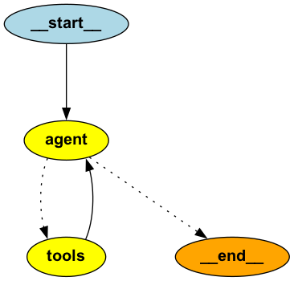

# 法務AIエージェント（実験）

> [!WARNING]  
> langgraphを用いたWorkflow AgentやAgentを実装する実験です。  
> 弁護士法第72条に抵触しない範囲でご利用ください。

## 概要

法務的な内容を相談可能なアシスタントとしてのワークフローエージェントシステムです。 

| No | 項目 | ファイル |
| --- | --- | --- |
| 1 | AI法務アシスタント: Workflow Agent | workflow.py |
| 2 | AI法務アシスタント: Agent(ReAct) | react.py |

## 1. AI法務アシスタント: Workflow Agent


| node名 | 説明 |
| --- | --- |
| qa_assistant | 法的な質問に対して単純に回答 |
| web_search | 質問に対してWeb検索した内容を踏まえて回答 |
| search_contract_files | ローカルに存在する契約書を検索し、1つのファイルのみを参照して質問に回答 | 

### 利用方法

<details>
<summary>法的な質問に対して単純に回答</summary>

```shell
❯ python workflow.py --question "準委任の契約書のレビューをするに際して把握しておくべき条文は？"

準委任契約に関する日本法の条文は、主に民法に規定されています。以下の条文を把握しておくと良いでしょう。

1. **民法第643条（委任の定義）**
   - 委任契約の基本的な定義が記載されています。

2. **民法第644条（委任の効力）**
   - 委任契約の効力についての基本的な規定です。

3. **民法第645条（受任者の注意義務）**
   - 受任者が業務を遂行する際の注意義務について規定しています。

4. **民法第646条（受任者の報告義務）**
   - 受任者が委任者に対して業務の遂行状況を報告する義務についての規定です。

5. **民法第647条（受任者の報酬）**
   - 受任者が報酬を受け取る権利についての規定です。

6. **民法第648条（委任の終了）**
   - 委任契約が終了する場合についての規定です。

これらの条文を理解し、契約書の内容がこれらの規定に適合しているか、または特約がある場合にはその特約がどのようにこれらの規定を修正しているかを確認することが重要です。また、具体的な契約内容に応じて、他の関連する法律や条文も考慮する必要があるかもしれません。
```
</details>

<details>
<summary>質問に対してWeb検索した内容を踏まえて回答</summary>

```shell
❯ python workflow.py --question "直近の労働基準法の改正に伴う労働条件の明示ルール変更についてwebで検索して教えて"

2024年4月に労働基準法の改正が行われ、労働条件の明示ルールが変更されます。この改正により、全ての労働者に対する労働条件明示事項が追加されることになりました。具体的には、有期労働契約の締結、更新、及び雇い止めに関する基準が改正され、モデル労働条件通知書やモデル就業規則も改正される予定です。この改正は、労働者の権利をより明確にし、労働条件の透明性を高めることを目的としています。
```
</details>

<details>
<summary>ローカルに存在する契約書を検索し、1つのファイルのみを参照して質問に回答</summary>

```shell
❯ python workflow.py --question "売買契約について書かれた書類を要約して"

契約書ファイル名「経済産業省物件売買契約条項.md」が見つかりました。

この契約書は、経済産業省が物件の売買に関する契約条項を定めたもので、以下の主要な内容が含まれています。

1. **適用範囲**: 契約はこの条項に基づいて行われます。

2. **権利義務の譲渡**: 乙は、甲の承諾なしに権利を第三者に譲渡できませんが、特定の金融機関に対する債権譲渡は例外です。

3. **下請負の禁止**: 乙は、甲の承諾なしに特定の条件下で下請負を行うことが禁止されています。

4. **納品と検査**: 乙は納品完了を甲に通知し、甲は10日以内に検査を行います。

5. **所有権の移転**: 引渡し完了時に所有権が移転します。

6. **契約不適合責任**: 甲は契約不適合があった場合、乙に修補や代替物の引渡しを求めることができます。

7. **対価の支払**: 検査合格後、甲は30日以内に対価を支払います。

8. **遅延利息と違約金**: 支払い遅延や納入遅延に対する利息や違約金が規定されています。

9. **契約の解除と損害賠償**: 甲は特定の条件下で契約を解除でき、損害賠償を請求する権利があります。

10. **法律遵守と人権尊重**: 乙は関連法令を遵守し、人権尊重に努める義務があります。

11. **紛争解決**: 契約に関する疑義や未定事項は甲と乙の協議で解決します。

この契約書は、売買契約における権利義務、納品、検査、所有権移転、契約不適合、支払い、遅延利息、違約金、契約解除、損害賠償、法律遵守、人権尊重、紛争解決などの詳細を規定しています。
```
</details>

## 2. AI法務アシスタント: Agent



| node名 | 説明 |
| --- | --- |
| agent | ReActエージェント |
| tools | 法的な質問に回答するツール、Web検索を行うツール、ローカルの契約書を探すツール |

<details>
<summary>法的な質問に対して単純に回答</summary>

```shell
❯ python react.py --question "準委任の契約書のレビューをするに際して把握しておくべき条文は？"

準委任契約のレビューを行う際に把握しておくべき条文は、主に以下の民法の条文です。これらの条文を理解することで、準委任契約の基本的な法律的枠組みを把握できます。

1. **民法第643条（委任の定義）**
   - 委任契約の基本的な定義が記載されています。準委任契約もこの条文に基づいて理解されます。

2. **民法第644条（委任の効力）**
   - 委任契約の効力についての基本的な規定が含まれています。

3. **民法第645条（受任者の注意義務）**
   - 受任者が委任事務を処理する際の注意義務について規定しています。

4. **民法第646条（受任者の報告義務）**
   - 受任者が委任者に対して報告する義務についての規定です。

5. **民法第647条（受任者の報酬）**
   - 受任者が報酬を受け取る権利についての規定です。

6. **民法第648条（委任の終了）**
   - 委任契約の終了事由についての規定です。

これらの条文を理解することが重要です。また、具体的な契約書の内容については、個別の契約書に記載された条項に従う必要があります。
```
</details>

<details>
<summary>質問に対してWeb検索した内容を踏まえて回答</summary>

```shell
❯ python react.py --question "直近の労働基準法の改正に伴う労働条件の明示ルール変更についてwebで検索して教えて"

近の労働基準法の改正により、労働条件の明示に関するルールが変更されます。この改正は2024年4月から施行されます。主な変更点は以下の通りです：

1. **就業場所・業務の「変更の範囲」の明示**：
   - すべての従業員に対して、就業場所や業務の変更の範囲を明示する必要があります。

これにより、労働者が自分の職務や勤務地がどのように変わる可能性があるのかを事前に把握できるようになります。

詳細については以下のリンクから参照できます：
- [Athrunの記事](https://athrun.co.jp/2023/11/07/【令和6年4月改正】労働条件明示等に関するｑ/)
- [新日本法規の記事](https://www.sn-hoki.co.jp/articles/article3404482/)
```
</details>

<details>
<summary>ローカルに存在する契約書を検索し、1つのファイルのみを参照して質問に回答</summary>

```shell
❯ python react.py --question "売買契約について書かれた書類を要約して"

以下は、「経済産業省物件売買契約条項」の要約です。

1. **適用範囲**: この契約は、指定された契約条項に基づいて行われます。

2. **権利義務の譲渡**: 契約の権利は、特定の条件を除き、第三者に譲渡できません。

3. **下請負の制限**: 特定の条件を満たした場合を除き、下請負は禁止されています。

4. **納品完了の通知**: 納品が完了した際には、即座に通知が必要です。

5. **検査と所有権移転**: 検査は一定期間内に行われ、合格後に所有権が移転します。

6. **契約不適合責任**: 契約内容に適合しない場合、修補や代替品の引渡しが求められます。

7. **対価の支払**: 検査合格後に対価を請求でき、支払いは30日以内に行われます。

8. **遅延利息と違約金**: 支払い遅延時には利息が発生し、納入遅延時には違約金が課されます。

9. **契約の解除と損害賠償**: 特定の条件で契約を解除でき、損害賠償の請求が可能です。

10. **法律の遵守**: 契約履行にあたって法律や規格の遵守が求められます。

11. **紛争の解決**: 契約に関する疑義や未定事項は協議で解決します。

この文書は、経済産業省の物件売買契約に関する詳細な条項を含んでおり、契約の実施、履行、および違反に関する要件を明確にしています。
```
</details>

## 環境構築

`.sample.env` に値を格納して `.env` を作成します。

`.env` ファイルを用いて環境変数の読み込みます。

```shell
mise env
```

python環境の構築を行います。

```shell
uv sync
```

検索対象となる契約書ファイルを追加する場合には、 `./documents/markdown` 配下に格納します。  

```shell
markitdown 契約書.pdf > documents/markdown/契約書.md
```

